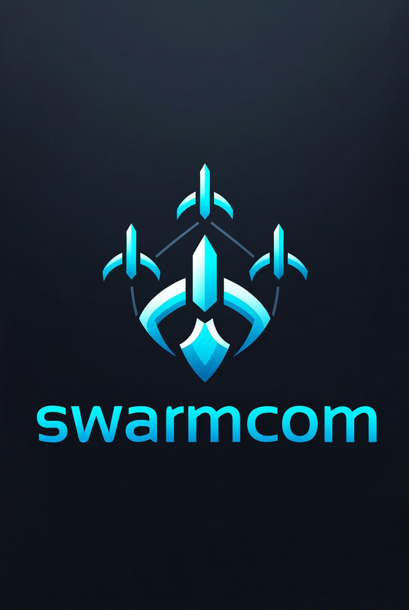

# SwarmCom

**The communication backbone for your multi-machine agent swarm.**



Turn multiple independent systems (Cursor, OpenClaw instances, Claude Code, Autonomo, etc.) into one coherent, coordinated team — with almost zero manual glue.

### Why SwarmCom?
As agents take over more IDE work, one developer often ends up running several machines and tools in parallel. The result? Scattered context, constant copy-paste, and mental overhead.

SwarmCom solves this by acting as a **lightweight, private communication layer** between your systems. It lets you:
- Register machines/nodes with simple roles (**boss**, **peer**, **worker**)
- Ask for aggregated status across all systems
- Automatically hand off tasks and artifacts
- Keep everything coordinated without losing the "one brain" view

It starts simple for personal multi-machine use and scales modularly — each node can have its own local hierarchy, then stitch together for teams or larger orgs.

## Key Features

- **MCP-native** — One MCP endpoint is all any tool needs to connect
- **Role-aware hierarchy** — Bosses query status, workers execute, peers collaborate
- **Smart handoffs** — Automatically route context and artifacts between systems
- **Modular & stitchable** — Nested nodes (personal → team → org) without a central monolith
- **Flexible transports** — Internal WebSocket (fast & local) + optional Matrix/Slack/Discord fallback
- **Private & self-hosted** — Everything stays on your machines
- **Socket-first** — Built with the same real-time socket patterns as Autonomo for smooth integration

## Quick Start

```bash
# 1. Install
npm install -g swarmcom
# or clone and build from source

# 2. Initialize your network
swarmcom init
