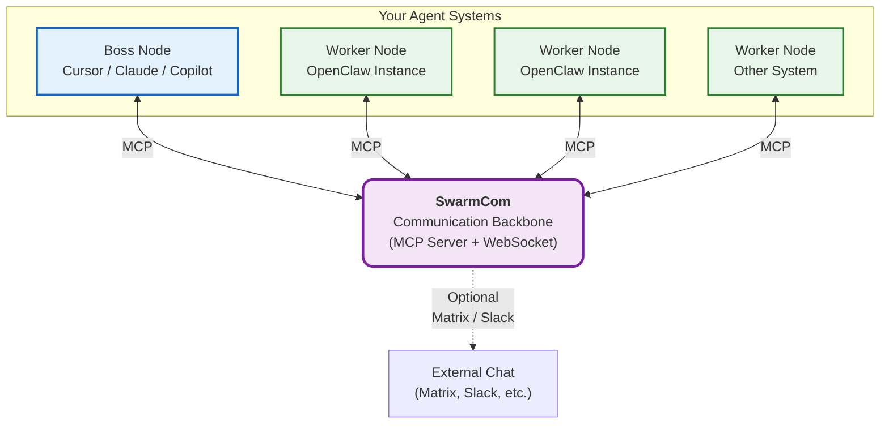

# SwarmCom

**The lightweight communication layer for your agent systems.**

**Purpose**:  
SwarmCom makes it easy to know **where things stand** across multiple independent agent systems and optionally send messages or instructions when needed.

It connects Cursor, Claude, Copilot, OpenClaw instances, and other MCP-compatible tools into a coherent network — without forcing heavy control or complex setup.

### Why SwarmCom?

When running multiple machines or agent setups in parallel, developers face scattered context and constant manual coordination.

SwarmCom solves this by acting as a **thin, private communication backbone**. You get:
- Clear visibility into the current status across all your nodes
- Simple messaging between systems
- Optional boss-level control (only on nodes that explicitly allow it)

It is **node-based** and **hierarchical** by design — each node can have its own bosses, peers, and workers, and nodes can be stitched together at any scale.

## Key Features

- **MCP-native** — One MCP endpoint is all any tool needs to connect
- **Visibility-first** — Easy aggregated status queries across all nodes
- **Optional communication & control** — Send messages or instructions only when a node accepts boss control
- **Node-based roles** — Flexible `boss`, `peer`, and `worker` roles per node
- **Hierarchical stitching** — Nodes can form nested structures at any scale
- **Dual integration** — Works natively with MCP clients (Cursor, Claude, Copilot) and OpenClaw (via community bridges)
- **Flexible transports** — Internal WebSocket by default + optional Matrix support
- **Private & self-hosted** — Everything stays on your machines

## How SwarmCom Works

