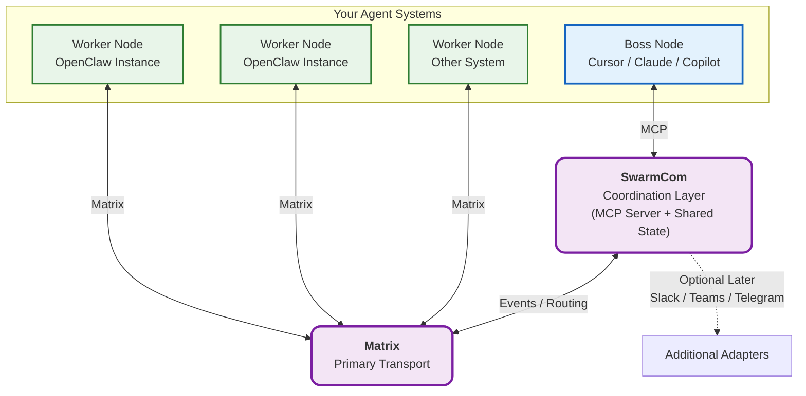

# SwarmCom

**The lightweight communication layer for your agent systems.**


**Purpose**:  
SwarmCom makes it easy to know **where things stand** across multiple independent agent systems and optionally send messages or instructions when needed.

It connects Cursor, Claude, Copilot, OpenClaw instances, and other MCP-compatible tools into a coherent network — without forcing heavy control or complex setup.

The implementation goal is to support native MCP clients and OpenClaw at the same time through one shared core, so client adapters never own business logic.

### Why SwarmCom?

When running multiple machines or agent setups in parallel, developers face scattered context and constant manual coordination.

SwarmCom solves this by acting as a **thin, private communication backbone**. You get:
- Clear visibility into the current status across all your nodes
- Continuously updated node status that can be quickly summarized across the network
- Simple messaging between systems
- Optional boss-level control (only on nodes that explicitly allow it)

It is **node-based** and **hierarchical** by design — each node can have its own bosses, peers, and workers, and nodes can be stitched together at any scale.

## Key Features

- **MCP-native** — One MCP endpoint is all any tool needs to connect
- **Visibility-first** — Easy aggregated status queries across all nodes
- **Snapshot plus real-time visibility** — Each node keeps an updatable status snapshot that supports both live updates and quick summaries
- **Optional communication & control** — Send messages or instructions only when a node accepts boss control
- **Node-based roles** — Flexible `boss`, `peer`, and `worker` roles per node
- **Hierarchical stitching** — Nodes can form nested structures at any scale
- **Dual integration** — Works natively with MCP clients (Cursor, Claude, Copilot) and OpenClaw (via community bridges)
- **Simultaneous multi-client support** — MCP clients and OpenClaw nodes can connect to the same SwarmCom instance concurrently
- **DRY core architecture** — One canonical node, status, and message model is shared across all integrations
- **Existing-network first** — Prefer Matrix and other mature transports before introducing custom network infrastructure
- **Flexible transports** — Local quick start first for development, Matrix first for real network transport
- **Private & self-hosted** — Everything stays on your machines

## Quick Start

SwarmCom now includes a local-first quick start so you can use the repo immediately without setting up Matrix first.

Quick start flow:

```bash
npm install
npm run quickstart
npm run dev -- serve
npm run dev -- update-status --summary "Working locally" --task "Testing SwarmCom"
npm run dev -- summary
```

What this does:

- creates `swarmcom-network.json`
- creates a local JSON status file and human-readable `STATUS.md`
- configures local `boss`, `peer`, and `worker` channel directories for development
- lets you test the status and summary workflow before Matrix exists

Use Matrix later when you want real cross-node transport.

## Local Matrix Testing

If you want to test the Matrix transport locally, this repo now includes a minimal Synapse harness.

Files:

- `docker-compose.matrix.yml`
- `planning/local-matrix-testing.md`

Typical flow:

```bash
npm run matrix:generate
npm run matrix:up
```

Then configure SwarmCom to use `matrix` transport in `.env` and point it at `http://localhost:8008`.

Convenience scripts:

```bash
npm run matrix:generate
npm run matrix:up
npm run matrix:logs
npm run matrix:down
```

This makes the Docker-backed Matrix server a practical quick-start server for local transport testing.

## Recommended Matrix Setup

SwarmCom uses local quick start mode for immediate development, and Matrix as the preferred real transport when you are ready to connect nodes across machines.

Recommended options:

- Hosted: Element Matrix Services (EMS) for the fastest production-friendly setup
- Self-hosted: Synapse on a cloud VM for organizations that want full control

Practical guidance:

- Use EMS when you want the simplest path to a managed Matrix deployment
- Use self-hosted Synapse when your organization needs tighter control over infrastructure, users, and policy
- Do not treat self-hosting Matrix as a hard requirement for adopting SwarmCom in v0.1

## Channel Trust Model

Each node should know the channels it uses for `boss`, `peer`, and `worker` communication.

For practical node-to-node trust, each channel should also have a shared secret used to sign messages or commands. That way a node can verify that a message claiming to come from an allowed participant was actually produced by someone who knows the channel secret.

Recommended approach:

- separate channel configuration for `boss`, `peer`, and `worker`
- separate shared secret per channel
- signed message envelopes for instruction or coordination traffic
- optional rejection of unsigned or invalidly signed messages on sensitive channels

Important limitation:

- a shared secret is a lightweight trust mechanism, not a full identity system
- it helps prevent random or accidental message injection
- stronger identity and permission layers may still be needed later for larger deployments

## Status Model

SwarmCom should treat status as both a live signal and a durable summary surface.

Each node should own and publish its latest status snapshot, ideally in a simple machine-readable file such as JSON. A Markdown view can still exist for humans, but JSON should be treated as the canonical format.

Each node status snapshot should include at least:

- current state
- short summary
- current task or focus
- last updated time
- optional structured metadata

That makes three workflows possible at once:

- real-time visibility when status changes
- fast network-wide summaries without re-querying every node manually
- ad hoc inspection when a boss or peer needs deeper context on demand

In hierarchical setups, each node should summarize its own subtree. That means a higher-level node does not need every leaf status by default. It should see the most relevant rolled-up status from the node directly below it, then drill deeper only when needed.

## How SwarmCom Works


