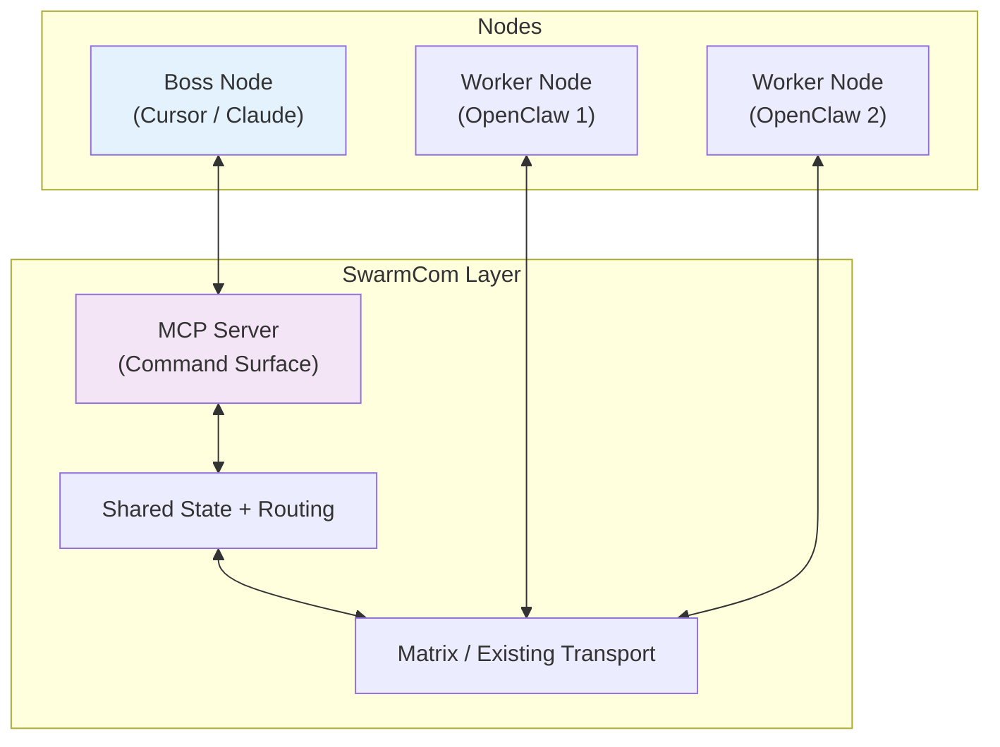

# SwarmCom Roadmap

**Project Goal**  
Build a lightweight, MCP-native communication layer that enables visibility and optional coordination across independent agent systems.

SwarmCom treats every participating machine or subsystem as a **Node**. Each node can have its own **bosses, peers, and workers**. 

The primary focus is **visibility** — knowing where things stand across your systems — with optional messaging and boss-level control when a node explicitly allows it.

It works seamlessly for a single developer with multiple machines as well as larger setups.

## How SwarmCom Works

SwarmCom sits in the middle as a thin communication layer:

## Core Design Principles

- **Visibility first**: Fast, aggregated status across all connected nodes.
- **Status as a first-class surface**: Every node maintains an updateable status snapshot for real-time visibility, rapid summarization, and ad hoc inspection.
- **Node-owned status**: The latest status should live with the node itself in a simple file or equivalent local source of truth.
- **Hierarchical summarization**: Higher-level nodes should consume summarized rollups from child nodes rather than every raw leaf update by default.
- **Optional communication & control**: Nodes can send/receive messages and optionally accept boss instructions.
- **Node-based architecture**: Every system registers as a node with flexible roles (`boss`, `peer`, `worker`).
- **Hierarchical & modular**: Nodes can be stitched together at any level (personal → team → organization).
- **MCP-first**: One MCP endpoint is all any system needs to join the network.
- **Dual-interface by design**: Native MCP clients and OpenClaw must work concurrently against the same running SwarmCom instance.
- **DRY integration model**: OpenClaw and MCP support must share one canonical domain model and one application service layer, with adapters kept thin.
- **Dual integration from day one**:
  - Native MCP clients (Claude, Cursor, Copilot extensions, etc.)
  - OpenClaw (via existing community MCP bridges)
- **Existing-network first**: Reuse mature transports where possible instead of building network plumbing prematurely.
- **Transport flexibility**: Matrix first, with optional WebSocket only for local or narrowly-scoped cases.

## v0.1 — Core Visibility + Basic Integration (Current Priority)

**Goal**: Deliver working visibility and messaging with solid integration for both MCP clients and OpenClaw from the very first version, while piggybacking on mature transport networks instead of building a custom backbone first.

### Must-Have Features

- `swarmcom init` — Creates `swarmcom-network.json`, transport configuration, and the MCP endpoint.
- **MCP Server** exposing the control surface for SwarmCom operations.
- **Node Registration** via MCP tool:
  - `register_node(node_id: string, role: "boss" | "peer" | "worker", name: string, capabilities: string[], accepts_boss_control: boolean)`
- Core MCP tools:
  - `update_status(status: object)` or equivalent node-local status publication flow
  - `query_status(node_id?: string)` — Get current status from one node or aggregated view
  - `query_summary(node_id?: string)` — Get summarized status for a node or subtree
  - `query_network()` — List all connected nodes with roles and high-level status
  - `send_message(channel: string, content: string, target_role?: string, target_node_id?: string)`
  - `hand_off_artifact(from_node_id: string, to_node_id: string, description: string, context?: any)` — optional
- Node status update flow that maintains the latest status snapshot for each node.
- Matrix transport adapter for messaging and updates.
- Optional local WebSocket transport only if needed for development or constrained environments.
- Lightweight persistence (SQLite recommended).

**Day-One Integrations**:
- **MCP clients** (Claude Desktop, Cursor, Copilot extensions, etc.): Connect directly via the MCP endpoint.
- **OpenClaw**: Support through Matrix-first integration or existing community MCP bridges, depending on which path is simpler and more stable in practice.

**Transport Strategy**:
- Prefer existing networks, especially Matrix, for cross-node messaging and presence propagation.
- Keep SwarmCom focused on shared state, routing rules, permissions, and protocol translation.
- Only add or keep a custom WebSocket transport where it materially simplifies local development or fills a capability gap.

**Status Strategy**:
- Treat each node's latest status as node-owned shared state, not just a transient event stream.
- Prefer a simple node-local JSON status file as the canonical latest snapshot format.
- Support both push-style updates and fast read-side summaries.
- Preserve enough recent status history to support ad hoc investigation and summarization.
- Default to hierarchical rollups so parent nodes see the most relevant status from each direct child before drilling into leaves.

**Implementation Constraint**:
- Support both integration paths at the same time without duplicating logic.
- Registration, status queries, permissions, and messaging must flow through the same core services regardless of whether the caller is OpenClaw or a native MCP client.

**Success Criteria**:
- I can run SwarmCom and connect both:
  - A native MCP client (e.g. Cursor or Claude) as a boss node
  - One or more OpenClaw instances as worker nodes
- Both client types can operate concurrently against the same network state and message history.
- I can query current status across all nodes.
- I can get a quick summarized view of what the network is doing based on the latest node snapshots.
- I can drill into a node's current or recent status on demand.
- A parent node can see summarized status from child nodes without loading every leaf node by default.
- I can send messages to specific nodes or roles.
- Nodes that allow boss control can receive optional instructions.

## v0.2 — Enhanced Visibility & Transports

- Persistent message and status history
- Better summarized status views and ad hoc status inspection
- Better hierarchical rollups and subtree summary queries
- Additional transport adapters beyond the initial Matrix-first path
- Role-based channels (`#boss-room`, `#peer-room`, `#worker-room`)
- Improved CLI commands (`swarmcom status`, `swarmcom nodes`)
- Better reconnection handling and connection status
- Support for nodes dynamically accepting/rejecting boss control

## v0.3 — Hierarchical Node Support

- Nested node hierarchies (parent/child relationships)
- Subtree status queries (`query_subtree_status`)
- Summarized reporting for higher-level bosses
- Cross-node handoffs with context
- Optional Slack / Discord / Teams / Telegram transport adapters

## v0.4 — Scalability & Polish

- Audit logging
- Performance improvements for larger networks
- Docker support
- Example configurations for different scales (single dev multi-machine, team, organization)

## Technical Guidelines

**Stack**:
- TypeScript (Node.js)
- Matrix transport integration as the preferred network layer
- MCP server implementation (supporting WebSocket + HTTP/stdio)
- SQLite for persistence
- Zod for validation

**Key Rules**:
- Visibility is the default experience.
- Control is always optional per node (`accepts_boss_control` flag).
- Make integration with OpenClaw and MCP clients as smooth as possible from day one.
- Reuse existing transport networks before building custom transport infrastructure.
- Keep the system lightweight and non-intrusive.

**Non-Goals**:
- Building a full orchestration or workflow engine
- Forcing automation on nodes
- Heavy UI (CLI-first)

---

**Living Roadmap**

Start with **v0.1** and ensure strong, practical integration with both native MCP clients and OpenClaw.

The core use case is simple:  
When running multiple machines or agent systems, quickly see where things stand and optionally send messages or instructions to nodes that allow it.

Point your LLM coder here with this instruction:  
**"Implement SwarmCom following this roadmap. From day one, ensure good integration with both native MCP clients (Claude/Cursor/Copilot) and OpenClaw via its community MCP bridges. Prioritize visibility, with optional messaging and boss control."**
